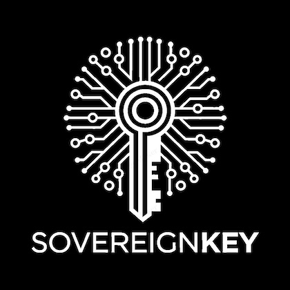

# SovereignKey (#SK)

The **SovereignKey (SK)** is a collection of Free and Open-Source Software (FOSS) tools designed to enhance your control and privacy in the digital realm. By transforming any computer it is plugged into and booted from, the SK provides a secure, self-managed environment for all your security-focused computing needs, including Bitcoin interactions via multiple options over the Tor network.

---

## Why Create the SovereignKey?

The SovereignKey exists to explore liberation and the emancipation of information, while simultaneously enabling the use of tools that safeguard your privacy and security. This project aims to solve the challenge of putting the future into the hands of those who will live in it, offering an accessible, affordable solution for managing digital value securely and privately.  

---

## Features

Encased within an ordinary USB drive (with varying GB options coming soon), the SK offers:  
- **Discreet Security**: Boots an operating system focused on sovereignty and privacy.  
- **Seamless Integration**: Built on battle-tested FOSS tools for optimal security and usability.  
- **Ease of Use**: No special technical knowledge is required beyond this README.  
- **Comprehensive Resources**: Links to all tools and technologies used are included to encourage further exploration and understanding.  

*Note*: While no expertise is required to start, we highly recommend that you `Do Your Own Research (DYOR)` on the included tools to maximize your experience.

---

## Installation Steps

To use the SK, you'll need to boot your computer from the USB device rather than its internal hard disk. This allows you to run the SK's custom operating system (OS) on the target machine.  

### Basic Steps
1. Turn off the computer.  
2. Insert the SK into a USB port.  
3. Turn on the computer.  
4. Access the Boot Menu by tapping/holding the appropriate hotkey.  
5. Select `Boot from USB/External USB`.  
6. Wait for Tails OS to load.  
7. Enter the default `Persistent Storage` passphrase and click `Unlock Encryption`.  
8. Select `Start Tails` on the top right.  
9. Connect to a local internet network.  
10. When prompted, select `Connect to Tor`.

 
PC Brands & Associated Hotkeys

### Computer Manufacturers
| Manufacturer      | Boot Menu Key          |
|-------------------|------------------------|
| Acer Series       | Esc, F12, F9           |
| Asus Series       | Esc, F8                |
| Compaq            | Esc, F9                |
| Dell Series       | F12                    |
| HP Series         | Esc, F9                |
| Lenovo Series     | F12, F8, F10           |
| Samsung Series    | F12, Esc               |
| Sony Series       | F10, F11, Assist       |
| Toshiba Series    | F12                    |

### Motherboards
| Manufacturer      | Boot Menu Key          |
|-------------------|------------------------|
| Asus              | F8                     |
| Gigabyte          | F12                    |
| MSI               | F11                    |
| Intel             | F10                    |
| ASRock            | F11                    |
| EVGA              | F7                     |

### Other Manufacturers
| Manufacturer      | Boot Menu Key                                   |
|-------------------|------------------------------------------------|
| Xiaomi            | Fn + F2 (Choose Boot Menu)                     |
| Panasonic         | F2 (Go to Exit Menu, then choose Boot Order)   |
| NEC               | F5                                             |
| Packard Bell      | F8                                             |
| eMachines         | F12                                            |
| Fujitsu           | F12                                            |
| Gateway           | F11, Esc, F10                                  |
| iBall             | F9 (Choose your media under Boot Option)       |
| Huawei            | F2                                             |
| Sharp             | F9                                             |

---

## Contribution Guidelines

Want to contribute? We welcome your input!  
Email us at [okin@okinent.org](mailto:okin@okinent.org), and we’ll follow up on how you can get involved. Contributions to the Knowledge Transfer section are especially encouraged.  

---

## Technologies Used  

The SovereignKey combines powerful, open-source technologies to create a "Swiss Army Knife" for digital sovereignty:  

- **[Tails OS](https://tails.boum.org)**: A portable operating system protecting against surveillance and censorship via the Tor network.  
- **[Electrum Wallet](https://electrum.org)**: A lightweight Bitcoin wallet focused on speed and simplicity.  
- **[BAILS](https://github.com/bitcoincore-dev/bails)**: A solution for secure Bitcoin Core installations and backups.  
- **[Sparrow Wallet](https://sparrowwallet.com)**: A feature-rich Bitcoin wallet for self-sovereignty.  
- **[SeedSigner Emulator](https://seedsigner.com)**: A tool for offline Bitcoin seed generation and signing, emulating the functionality of the SeedSigner hardware for enhanced privacy and control.  
- **[VSCodium](https://vscodium.com)**: A fully open-source version of Visual Studio Code for secure and private coding environments, free from telemetry concerns.  

 
Knowledge Transfer

### Free Books - A Collection of Curated Books on Bitcoin & Financial Literacy  

- [The Bitcoin Whitepaper (Available in various Languages)](https://exonumia.africa) by Satoshi Nakamoto  
- [2nd Edition: The Simplest Bitcoin Book Ever Written](https://d.nostr.build/tIkvB3qVy5jVkH48.pdf) by Keysa Luna  
- [Bitcoin: Separation of Money and State](https://braiins.com/books/bitcoin-separation-of-money-and-state) by Josef Tětek  
- [The Bitcoin Standard](https://worldfreebooks.com/book/the-bitcoin-standard-by-saifedean-ammous/) by Saifedean Ammous  
- [Bitcoin For Business](https://studentofbitcoin.gumroad.com/l/bitcoinforbusinesses?layout=profile) by Student of Bitcoin  
- [Codex32 - Shamir Secret Sharing Scheme](https://secretcodex32.com/docs/index.html) by Leon Olsson Curr & Pearlwart Snead  

### Media  
- [The World’s First Kids Cartoon about Bitcoin!](https://www.youtube.com/watch?v=_ekzsZZGfsk) by Tuttle Twins  

---

## A Few Ways to Help & Info on Proceeds  

The SovereignKey is a passion project, and I sincerely thank you for your interest and support in helping make it a reality.  

Since discovering Bitcoin in 2019/2020, I have been driven to make a meaningful contribution to its growth and adoption. I truly believe that self-custodial ownership and the responsible use of our data and value are critical to personal sovereignty. We must strive to reduce what is leaked to big or small tech, wherever we can control it.  

This vision, combined with a burning desire to get cutting-edge technology into the hands of those who need it most, has led me to create the SovereignKey. This is my contribution to the Bitcoin ecosystem and the ongoing fight for digital sovereignty.  

### Donate Bitcoin  

If you would like to support the SovereignKey project directly, Bitcoin donations are welcome.  

Scan the QR code below or copy the address to your Bitcoin wallet:

 
Bitcoin Donations for the SovereignKey

  
- `PM8TJVXfQHoWyh7ep5H4YzGaRaNBAF83gMt2Fjsgx4MxnbBfwNdyitQd6vMmoHDcBUcr7r22ae1pAyfB2hj1VHWcKURPfuUNNRXQDeCqggA67HYF6nZy`  
- `lno1zrxq8pjw7qjlm68mtp7e3yvxee4y5xrgjhhyf2fxhlphpckrvevh50u0q20uws7nja2z3q7d2ylcq5pznshjyhljwhyepudhnpqleceepyzlcqszgjw5crtfxd5f6ayefhkyjf3n52z20a3nm74zel54l0g3uvwx967qqv7xv7tkcjq97t5e25l02crh4r9h4fk0xh39lvz9gvw6fyykzz9avcxrwmlucemfw0nrqkkqurqdcc7pz2npqwqvkh7t77wsj332lmvslwu95qdvj6zjhstx3wchgjfll6njnsfkgqqs9w3h7clsnr82uuzgggdxy8xs4s`  

---

## Warnings / Known Issues

 
Known Limitations

- Tails does not currently support Mac devices with Apple M1 chips or some older Mac models.

